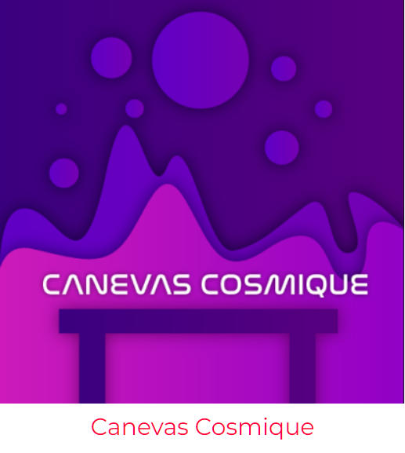
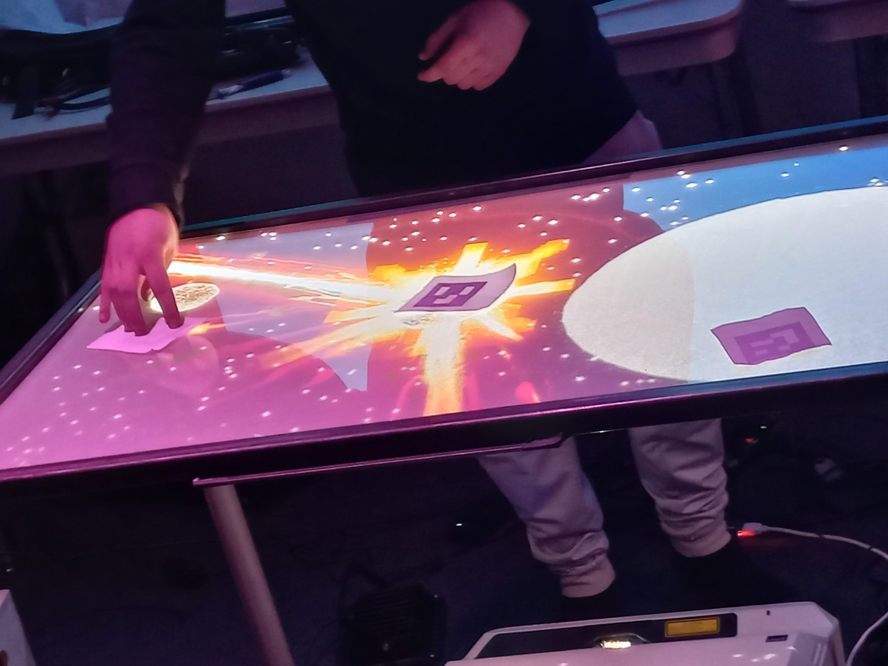

# Canevas Cosmique (2024)
  
Photo provenant de la page d'exposition de Crescentia.  
**Réalisé par Jacob Alarie-Brousseau, Étienne Charron, Jérémy Cholette, Quoc Huy Do et 
Mikaël Tourangeau**  
 
L'œuvre consiste aux utilisateurs de se rassembler autour d'une table et s'amuser avec
différents éléments, les mélanger et voir les résultats. 
## Lien avec crescentia
Le lien avec la croissance ici est le mélange de plusieurs éléments font qu'ils créent
quelque chose de nouveau et donc évolue à sa manière.
## Plantation 
Voici le plan pour montrer en détail où chaque élément doit être placé.  
  
Photo provenant de la page de l'exposition de Crescentia.  
 
## À quoi ça ressemblait lors de ma première visite
  
Photo venant de moi.  
Les éléments imprimés en 3d n'étaient pas encore terminés mais on pouvait quand
même intéragir avec les codes qr.
 
## Vue d'ensemble finale
  
Photo venant du site web de Crescentia.  
On voit que tout les éléments sont imprimés et prêts à être utilisé.
## Ressenti
Ce que je ressentirais lorsque je l'essayerais, c'est de la curiosité et de la
réflexion. J'essayerais toute les possibilitées mais je m'ennuyerais assez
rapidement.
## Ordre préférence
> 5  
>
Canevas cosmique vient en 5e position car je trouve que les gens s'ennuyeraient
rapidement à cause du manque d'intrigue. C'est simple mais je trouve que si on
ajoutait un but ou une histoire, l'interaction prendrait un autre sens et rendrait
l'expérience plus mémorable. 
#### Références
Photos provenantes de la page d'exposition de Crescentia :  
https://tim-montmorency.com/2024/  
