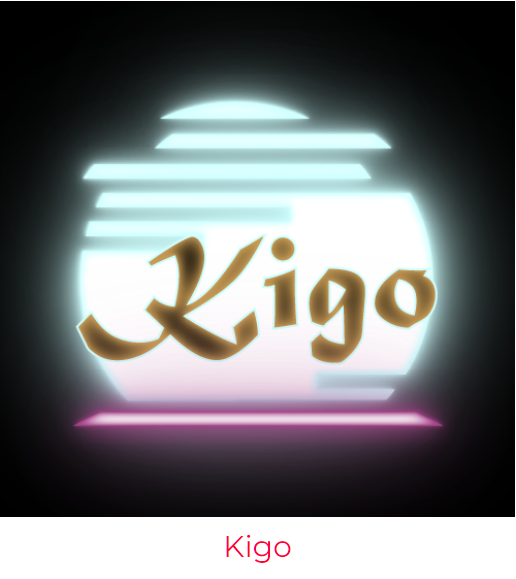
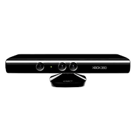
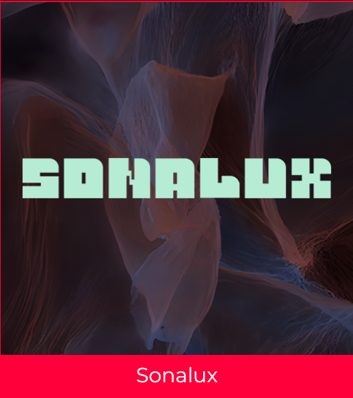

# Présentation de mon projet préfèré des 3e années.
J'ai visité les projets 2 fois, le 27 février et 12 mars. 
# Rhizomatique (2024)
  
Photos provenantes de la page d'exposition de Crescentia.   
**Réalisé par Jolyanne Desjardins, Maïka Devy, Laurie Houde et Felix Testa Radovanovic**  
#### Lien avec Crescentia
Rhizomatique est une oeuvre multiédia immersive et interactive qui relie l'humain et le temps. C'est en
lien avec le mot crescentia qui signifie "croissance", car quand on grandi, les souvenirs s'effacent et
d'autres se font. 
> **Type d'installation : Interactive et immersive**
> 
### Interaction 
L'interaction de l'oeuvre se fait face à une toile qu'on appuie pour faire apparaître des souvenirs. C'est
comme un cerveau, si on veut. Si on appui rapidement, un souvenir flou apparaît, mais si on appuie longtemps
et qu'on utilise toute notre main, on voit le souvenir devenir plus clair. Il y a différents souvenirs qui
apparaîssent si on appuie à gauche, à droite ou au millieu de la toile. Voici à quoi ça ressemble.  
 
     
 
Les photos ont été prises lorsque j'appuyais à gauche, à droite et au millieu de la toile.
## Fonction 
Pour la mise en contexte, je trouve que le début de la vidéo sur le site web de Crescentia l'explique bien.  
https://www.youtube.com/watch?v=2uqujLtmH3o  
## Mise en espace 
La mise en espace est constituée d'une projection qui se projette sur trois murs avec la toile au centre.
Les souvenirs peuvent se projetter sur le mur gauche si la personne appuie le côté gauche de la toile, par
exemple. Il y a trois projecteurs pour afficher les souvenirs. Un au centre et sur les côtés, près des 
de la toile. Pour le son, il y a des haut-parleurs à côté des projecteurs des deux côtés.  
       
Photos venant de la vidéo du projet.
## Composantes et techniques 
**Matériaux utilisés**
> Kinects  
> Cyclomoteur  
> Construction en bois avec toile  
>
Pour déplacer l'oeuvre, il faudra que le cyclomoteur, les hauts parleurs et la kinect soit dans une boîte 
avec les cables.
## Mise en exposition
Voici les éléments importants pour la mise en exposition.  
> Projecteurs  
> Haut-parleurs  
> Powercom  
> Ordinateur portable  
> Lumière LED  
## Expérience vécue 
Je trouve que le tout est assez immersif. C'est quelque chose d'intime de découvrir les souvenirs d'une 
personne et cela apporte une perspective différente sur, peut-être, la vie en général et comment elle 
peut être vécue. Le fait qu'on soit dans le noir nous aide à réellement nous transporter dans l'oeuvre.
## Ce qui m'a plu, donné des idées
L'autre perspective que l'experience propose sur la vie. On peut en apprendre beaucoup si on réfléchi sur
le sujet.
Ce qui m'a inspiré, c'est vraiment l'effet que ça m'a donné. J'aimerais que d'autres personnes le ressent
dans mes projets.
## Ce que je ferais différemment
Ce que je ferais différemment, c'est d'ajouter que lorsqu'une deuxième personne appuie sur la toile, deux
vidéos apparaîssent ou alors mélangent des souvenirs d'autres personnes.
### Ordre Préférence
> 1
>
Rhizomatique est en première position pour sa connection avec des souvenirs d'autres personnes. Cela permet
de se souvenir de moments similaires qu'on a vécu et ainsi faire ressentir de la nostalgie et de l'empathie.
J'aime beaucoup cet aspect humain car nos souvenirs nous rassemblent et nous rappelle l'importance des
souvenirs de l'enfance. Je trouve qu'utiliser une toile rend l'expérience unique car elle utilise le sens 
du toucher.
# Présentation des autres projets
## Effet-papillon (2024)
  
Photos provenants de la page d'exposition de Crescentia.   
**Réalisé par Raphaël Dumont, Alexis Bolduc, William Morel, Alexia (Ryan) Papanikolaou, Viktor Zhuravlev et
Jasmine Lapierre**  
 
Effet-papillon est un projet qui consiste à faire des actions qui semblent insignifiantes mais elles ont de 
plus grandes conséquences de se qu'on pensait au départ. L'interaction est basée sur des actions grace à des 
intermédiaires pour ainsi faire pousser un pommier.  
#### Lien avec crescentia
Puisque crescentia signifie croissance, le lien ici est la croissance d'un arbre.
### Plantation 
Voici le plan pour montrer en détail où chaque élément doit être placé.  
  
Photo provenant du github du projet.  
 
**À quoi ça ressemblait lors de ma première visite**  
         
      Photos prises par moi.  
       
Il y avait cette image tout autour de la salle pour montrer qu'il y aura une vidéo qui sera projetée. Il y 
avait aussi les led lights pour les racines qui n'étaient pas encore dans les tubes de caoutchou. Il n'y 
avait pas encore les technologies pour chacune des actions.  
### Vue d'ensemble finale
   
Photos provenantes de la page d'exposition de Crescentia. 
### Cours indispensables pour la réalisation
> Programmation  
> Objets Interactifs  
> Modélisation 3d  
### Ressenti
Ce que je ressentirais lors de l'expérience, c'est de la curiosité car je verrais un poteau avec des
écrans et un bouton qui clignote, je ressentirais aussi de l'importance aux actions que je pose car
le progrès de la croissance de l'arbre dépend de moi.
### Ordre préférence
> 3  
>
Sur 5, Effet papillon est en 3e position, car je trouvais que l'idée derrière était intéressante, mais
je trouve que l'expérience est trop courte. Je pense qu'il faudrait rendre le résultat de chaque action
plus longue pour vraiment représenter l'impact, surtout que le nom est Effet-papillon donc je mettrais
la lumière sur les conséquences des actions. Le concept est bien pensé et il y a beaucoup d'interaction,
mais je trouve que le côté visuel aurait été mieux. Ils auraient pu utiliser des banderoles et les
accrocher au plafond pour faire un feuillage, par exemple.
## Kigo (2024)
  
Photos provenant de la page d'exposition de Crescentia.  
**Réalisé par Érick Ouellette, William Rathier Mailly, Gabriel Clerval, Nicolas St-Martin et Antoine Dion**  
 
Le projet ressemble à un jeu comme Subway Surfers, où le joueur doit éviter des obstacles. C'est la même 
chose avec Kigo, le joueur doit éviter des obstacles qui s'approche de lui et essayer d'avoir le score le 
plus haut possible. La difficulté augmente au fur et à mesure avec la vitesse qui augmente lentement et il 
y a différentes saisons pour chaque difficulté. 
#### Lien avec crescentia
Le cycle des saisons représente aussi Crescentia, car à chaque fin de cycle, les arbres poussent petit à
petit. Le cycle lui-même peut signifier croissance car l'évolution des saisons est une forme de croissance
avec le printemps, l'été, etc.
### Plantation 
Voici le plan pour montrer en détail où chaque élément doit être placé.  
  
Photo provenant de la page de l'exposition de Crescentia.  
**À quoi ça ressemblait lors de ma première visite**  
  
Photos venant de moi.  
Il y avait seulement une ou deux saisons et le model de la kinect n'était pas détaillé.
### Vue d'ensemble finale
  
Photo prise par moi.  
Ici, le model de la kinect est détaillé et s'harmonise bien avec le fond. 
### Cours indispensables pour la réalisation
> Programmation ludique  
> Modélisation 3d  
> Réalité Mixte  
## La Kinect
  
Photo provenant de Google.  
La composante que je ne connais pas et qui est présent dans les projets est la kinect. C'est une technologie 
qui interagit avec la voix et le mouvement.  
La kinect est utilisée dans l'Xbox 360 avec sa première version et l'Xbox 1 avec la deuxième version. Elle 
est sortie vers les années 2010.
La kinect est composée d'une lumière infrarouge qui permet de détecter un humain. Elle possède aussi un
capteur de mouvement pour détecter quelque chose qui bouge. Elle scanne donc son environnement et peut capter
une vingtaine de points de mouvements. Elle superpose le squelette crée à partir de ces points de mouvements
avec la caméra de couleur. Ce que la kinect voit est affiché ensuite.
### Ressenti
Ce que je ressentirais lorsque je l'essayerais, c'est de la détermination parce que je voudrais avoir le score
le plus haut possible. Je ressentirais aussi de la compétition car je saurais qu'il y a d'autres personnes qui
ont un score plus haut que moi. L'adrénaline est aussi ce que je ressentirais car ça va de plus en plus vite.
### Ordre préférence
> 2  
>
Kigo vient en 2e position avec son divertissement. Quand je voyais des gens l'essayer, j'étais facilement
captivée par le jeu. Ce mode de jeu peut très bien devenir des compétitions avec des statistiques. Je trouve
que ça combine le sport et les jeux vidéos et je trouve ça innovatif. Cela permetterait de faire bouger les
amateurs de jeux vidéos un peu plus. 
## Sonalux (2024)
  
Photos provenant de la page d'exposition de Crescentia.  
**Réalisé par Antoine Haddad, Camélie Laprise, Ghita Alaoui, Vincent Desjardins**  
 
Sonalux est un projet assez sonore. Il permet à l'utilisateur de faire une harmonie avec quatres mélodies
différentes. Son visuel aide à nous faire oublier le temps qui passe et nous immerser dans l'expérience.
#### Lien avec crescentia
Ses couches de sons qu'on peut alterner entre elles font que le tout peut devenir graduellement chaotique.
L'évolution de ses sons font qu'elle sont liées au mot ¨crescentia¨, qui signifie croissance.
### Plantation 
Voici le plan pour montrer en détail où chaque élément doit être placé.  
  
Photo provenant de la page de l'exposition de Crescentia.  
**À quoi ça ressemblait lors de ma première visite**  
Au début, le podium n'était qu'une simple planche de bois et il y avait seulement quelques touches 
installées. Il était en bois mais les mélodies fonctionnaient. 
### Vue d'ensemble finale
La vue d'ensemble finale ressemble à ceci.  
https://www.youtube.com/embed/ZzHd1uTlD5E?si=NR7S8UgKJX5NVMOH  
Vidéo venant de la documentation.
### Cours indispensables pour la réalisation
> Traitement Audiovisuel  
> Installation Multimédia  
> Conception Sonore  
### Ressenti
Ce que je ressentirais, c'est du malaise car ce n'est pas prédible et les visuels me donneraient un peu
le tourni. Je  ressentirais aussi de la curiosité face aux boutons devant moi et je me questionnerais
de quels sons il s'agit. Les musiques me feraient ressentir quelque chose de différent à chaque fois
aussi. 
### Ordre préférence
> 4  
>
Au début, je trouvais que c'était intriguant car on voit un texte qui dit "chaque geste compte", alors 
cela nous invite à interagir avec elle. Sur 5, Sonalux vient en 4e à cause du manque de clarté. Si un 
jour, je suis une personne qui vient visiter l'expérience, je ne saurais pas trop le message derrière. 
Pour moi, je verrais que j'ai du contrôle sur la musique mais je ne comprendrais pas le sens derrière. 
Il y a quand même de l'émotion dans l'expérience et elle nous intrigue. 
## Nom projet (année réalisation)
![photo expo]  
Photos provenant de la page d'exposition de Crescentia.  
**Réalisé par nom, nom, nom**  
 
Description
#### Lien avec crescentia
 
### Plantation 
Voici le plan pour montrer en détail où chaque élément doit être placé.  
<photo ici>  
Photo provenant de la page de l'exposition de Crescentia.  
**À quoi ça ressemblait lors de ma première visite**  
<photo ici>  
Photos venant de moi.  
description
### Vue d'ensemble finale
<Photo ici>  
Photo prise par moi.  
Description
### Cours indispensables pour la réalisation
> 1  
> 2  
> 3  
### Ressenti
Description et justification ici
### Ordre préférence
> 1-5  
>
Explication ici.
#### Références
Photos provenantes de la page d'exposition de Crescentia :  
https://tim-montmorency.com/2024/  
Github du projet Effet-papillon :  
https://github.com/Iteration6/Effet-Papillon/tree/2b2e73f72208211f2ff77f123d528beb9cf9ef03
#### Références
Photos provenantes de la page d'exposition de Crescentia :  
https://tim-montmorency.com/2024/  
Github du projet Effet-papillon :  
https://github.com/Iteration6/Effet-Papillon/tree/2b2e73f72208211f2ff77f123d528beb9cf9ef03
