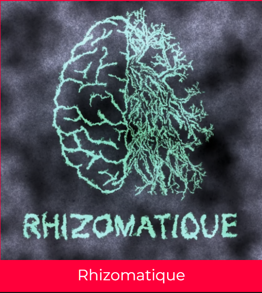
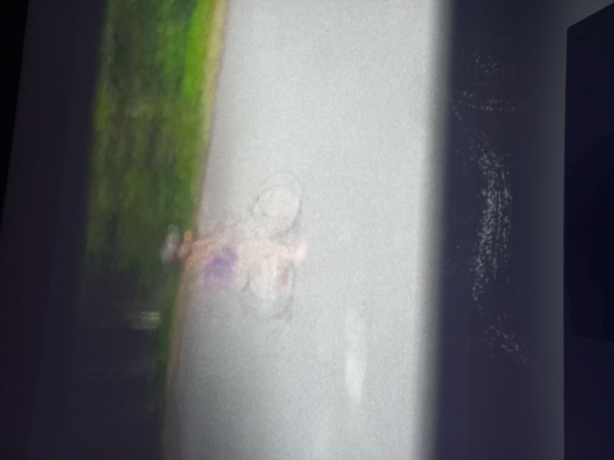
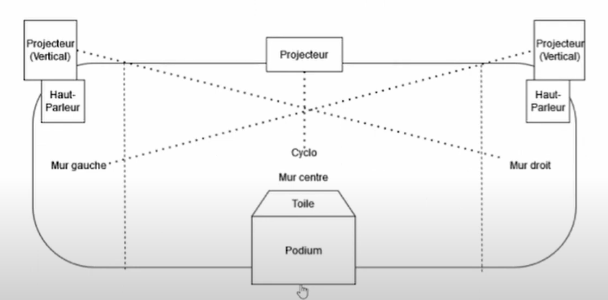
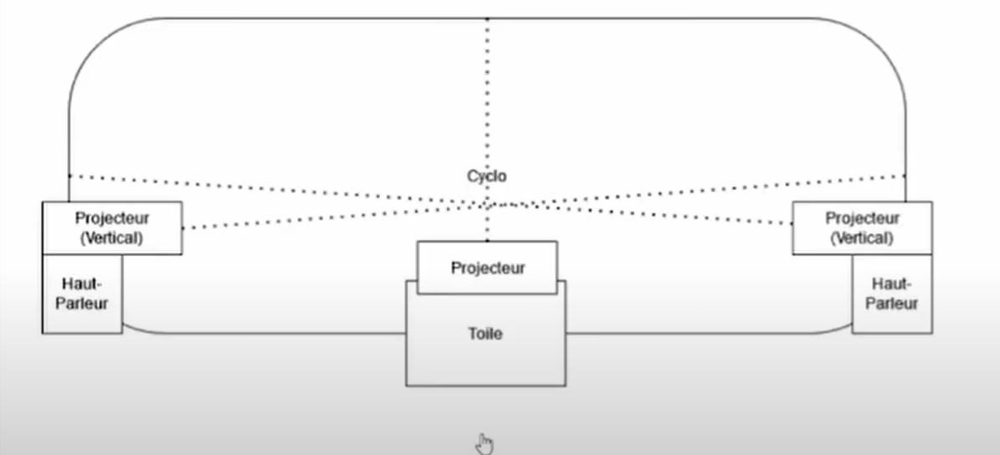
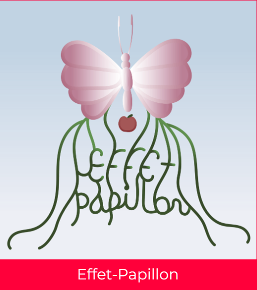

# Présentation de mon projet préfèré des 3e années.
J'ai visité les projets 2 fois, le 27 février et 12 mars. 
# Rhizomatique (2024)
  
Photos provenantes de la page d'exposition de Crescentia.   
**Réalisé par Jolyanne Desjardins, Maïka Devy, Laurie Houde et Felix Testa Radovanovic**  
#### Lien avec Crescentia
Rhizomatique est une oeuvre multiédia immersive et interactive qui relie l'humain et le temps. C'est en
lien avec le mot crescentia qui signifie "croissance", car quand on grandi, les souvenirs s'effacent et
d'autres se font. 
> **Type d'installation : Interactive et immersive**
> 
### Interaction 
L'interaction de l'oeuvre se fait face à une toile qu'on appuie pour faire apparaître des souvenirs. C'est
comme un cerveau, si on veut. Si on appui rapidement, un souvenir flou apparaît, mais si on appuie longtemps
et qu'on utilise toute notre main, on voit le souvenir devenir plus clair. Il y a différents souvenirs qui
apparaîssent si on appuie à gauche, à droite ou au millieu de la toile. Voici à quoi ça ressemble.  
 
     
 
Les photos ont été prises lorsque j'appuyais à gauche, à droite et au millieu de la toile.
## Fonction 
Pour la mise en contexte, je trouve que le début de la vidéo sur le site web de Crescentia l'explique bien.  
https://www.youtube.com/watch?v=2uqujLtmH3o  
## Mise en espace 
La mise en espace est constituée d'une projection qui se projette sur trois murs avec la toile au centre.
Les souvenirs peuvent se projetter sur le mur gauche si la personne appuie le côté gauche de la toile, par
exemple. Il y a trois projecteurs pour afficher les souvenirs. Un au centre et sur les côtés, près des 
de la toile. Pour le son, il y a des haut-parleurs à côté des projecteurs des deux côtés.  
       
Photos venant de la vidéo du projet.
## Composantes et techniques 
**Matériaux utilisés**
> Kinects  
> Cyclomoteur  
> Construction en bois avec toile  
>
La composante que je ne connais pas et qui est présent dans les projets est la kinect. C'est une technologie 
qui interagit avec la voix et le mouvement. Dans ce cas-ci, deux kinects sont utilisées pour détecter la 
chaleur de la main sur la toile avec la caméra infrarouge et l'autre pour le mouvement. Les souvenirs sont 
ainsi projectés sur l'un des trois murs, dépendamment ou l'utilisateur appuie.  
Pour déplacer l'oeuvre, il faudra que le cyclomoteur, les hauts parleurs et la kinect soit dans une boîte 
avec les cables.
## Mise en exposition
> Projecteurs  
> Haut-parleurs  
> Powercom  
> Ordinateur portable  
> Lumière LED  
## Expérience vécue 
Je trouve que le tout est assez immersif. C'est quelque chose d'intime de découvrir les souvenirs d'une 
personne et cela apporte une perspective différente sur, peut-être, la vie en général et comment elle 
peut être vécue. Le fait qu'on soit dans le noir nous aide à réellement nous transporter dans l'oeuvre.
## Ce qui m'a plu, donné des idées
L'autre perspective que l'experience propose sur la vie. On peut en apprendre beaucoup si on réfléchi sur
le sujet.
Ce qui m'a inspiré, c'est vraiment l'effet que ça m'a donné. J'aimerais que d'autres personnes le ressent
dans mes projets.
## Ce que je ferais différemment
Ce que je ferais différemment, c'est d'ajouter que lorsqu'une deuxième personne appuie sur la toile, deux
vidéos apparaîssent ou alors mélangent des souvenirs d'autres personnes. 
# Présentation des autres projets
## Effet Papillon (2024)
  
Photos provenantes de la page d'exposition de Crescentia.   
**Réalisé par Raphaël Dumont, Alexis Bolduc, William Morel, Alexia (Ryan) Papanikolaou, Viktor Zhuravlev et
Jasmine Lapierre**  
 
Effet-papillon est un projet qui consiste à faire des actions qui semblent insignifiantes mais elles ont de 
plus grandes conséquences de se qu'on pensait au départ. L'interaction est basée sur des actions pour ainsi
faire pousser un pommier. Les actions sont, en ordre, planter la graine, pousser le tronc, manifester la
pluie, faire pousser les feuilles et ainsi récolter la pomme à la fin. La personne dans l'expérience doit 
faire ces actions avec une variété de technologies (bouton, valve, interrupteurs de lumière, corde). Le tout
a été fait sur MadMapper (projections sur les écrans et des lumières LED). Pour côté visuel, ils ont mis
un pole et des magic arms pour représenter les branches. On voit donc le tronc et les feuilles sur les écrans.
À chaque action, il y a une interaction avec les LED. Lorsque l'utilisateur progresse dans l'interaction, 
de plus en plus de sons peuvent se faire entendre. Dans la salle, il y aura des LED lights au plafond pour les 
feuilles et à terre, pour les racines, dans des tubes de caoutchou.  
**À quoi ça ressemblait lors de ma première visite**  
         
Il y avait cette image tout autour de la salle pour montrer qu'il y aura une vidéo qui sera projetée. Il y 
avait aussi les led lights pour les racines qui n'étaient pas encore dans les tubes de caoutchou. Il n'y 
avait pas encore les technologies pour chacune des actions.  
### Vue d'ensemble finale
   
Photos provenantes de la page d'exposition de Crescentia. 
#### Lien avec crescentia
Puisque crescentia signifie croissance, le lien ici est la croissance d'un arbre.
#### Références
Photos provenantes de la page d'exposition de Crescentia :  
https://tim-montmorency.com/2024/
