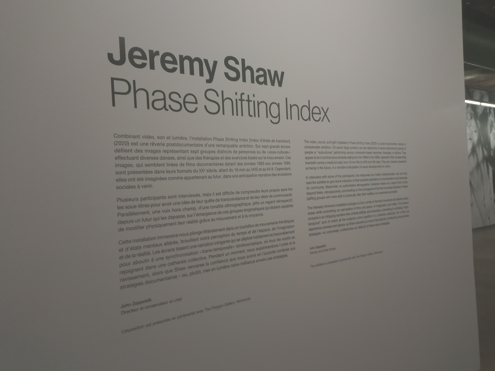
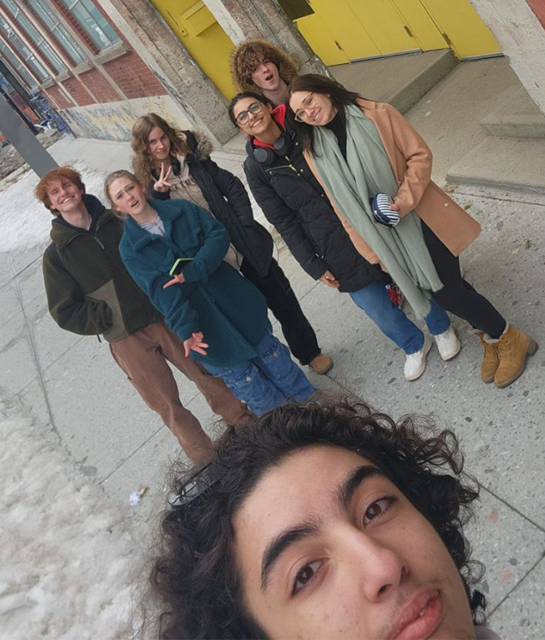
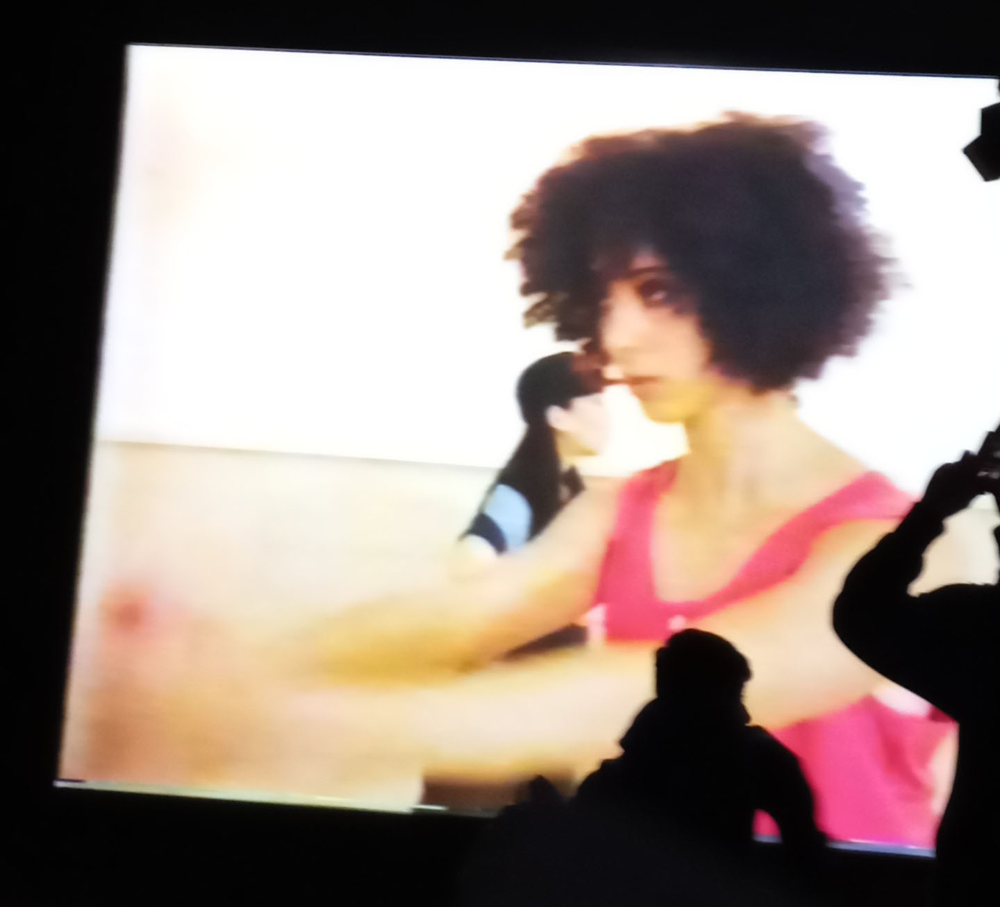
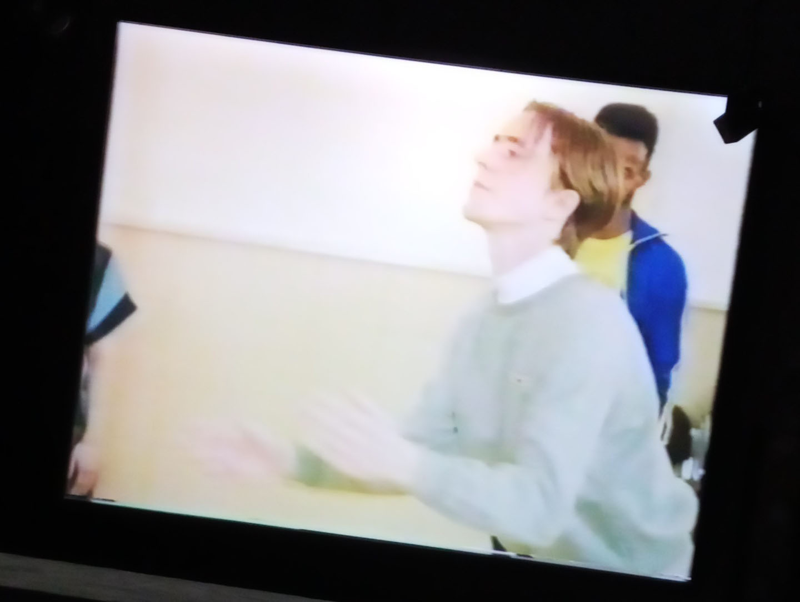

# Phase Shifting Index

Voici moi devant le batiment (deuxième personne à partir de la gauche)

L'exposition se trouve à la Fonderie Darling. Nous l'avons visité le 2 février 2024 et c'est une exposition
de type temporaire puisu'elle était disponible du 12 décembre 2023 jusqu'au 25 février 2024 et immersive puisqu'on
est invités à être plongé dans une expérience. Elle est aussi interieure puisqu'on a besoin de support 
pour les vidéos.

# **Description de l'oeuvre**

Jeremy Shaw, étant l'artiste derrière l'oeuvre, a voulu explorer l'effet psychydélique de drogues dans cette 
expérience. L'exposition a été exposée pour la première fois en 2020.
Dans l'installation, il y a 7 écrans présents, il a figuré des personnes de son entourage. Il a varié les 
espaces temps dans chacune d'elles dans un objectif de nous mélanger et ne pas nous faire voir le temps
passé. Voici certaines photos des vidéos qui étaient projetés.

                             
