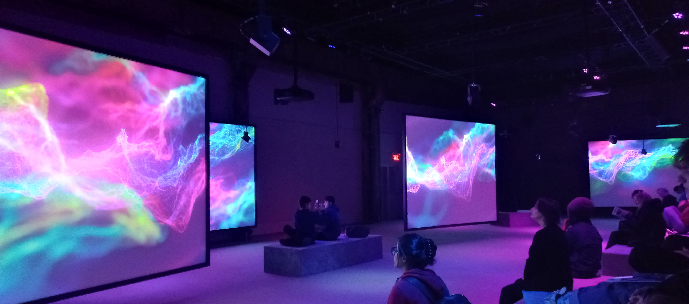
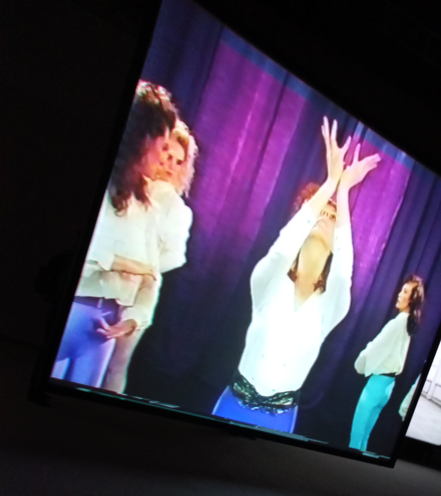
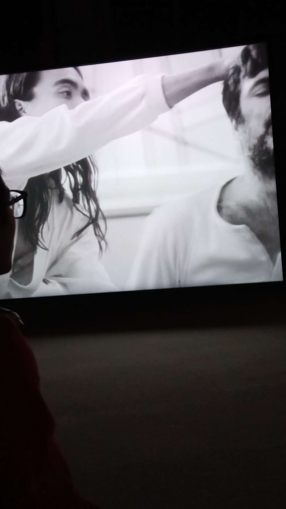
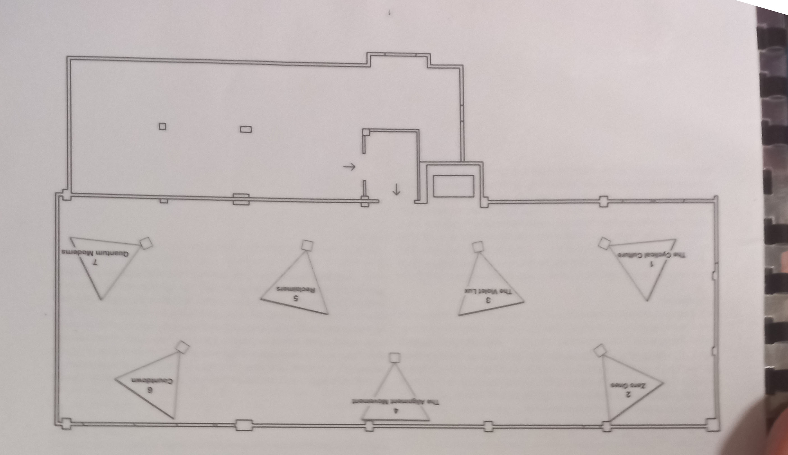
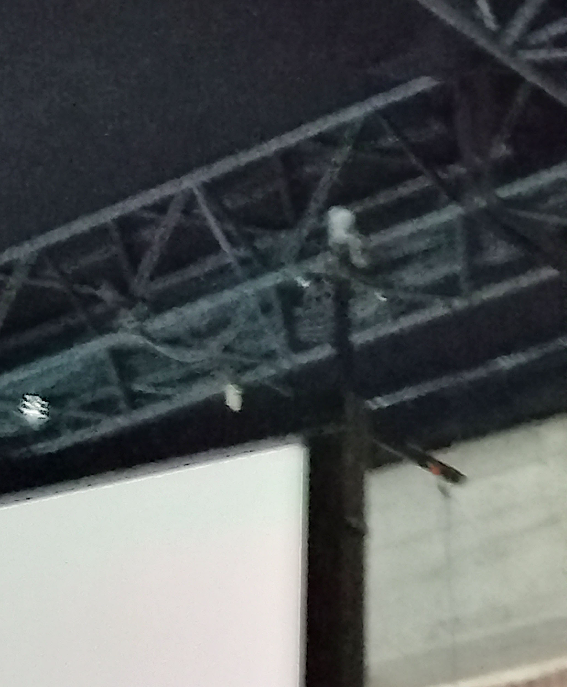
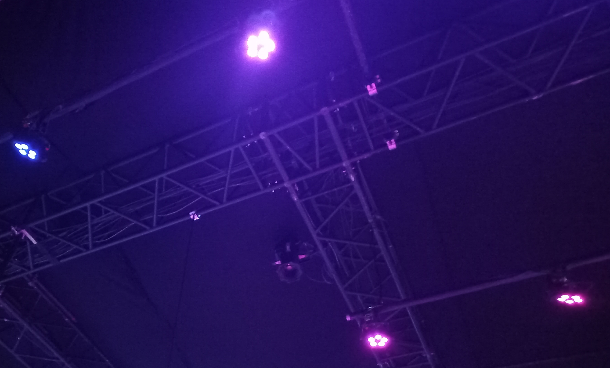
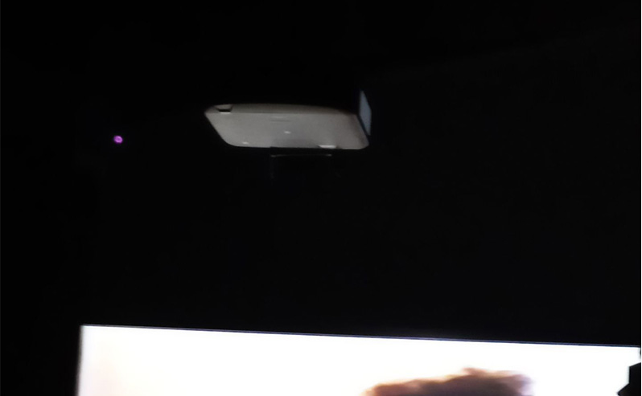

# Phase Shifting Index

Voici moi devant le batiment (troisième personne à partir de la gauche)

## Introduction

L'exposition se trouve à la Fonderie Darling. Nous l'avons visité le 2 février 2024 et c'est une exposition
de type temporaire puisqu'elle était disponible du 12 décembre 2023 jusqu'au 25 février 2024. Elle est immersive puisqu'on
est invités à être plongé dans une expérience. Elle est aussi interieure puisqu'on a besoin de support pour les vidéos.  
 

## **Description de l'oeuvre**

Jeremy Shaw, étant l'artiste derrière l'oeuvre, a voulu explorer et faire ressentir l'effet psychydélique et euphorique de 
drogues dans cette expérience. Il a figuré des personnes de son entourage qui étaient autrefois ses clients qui consommaient 
de la drogue hallucinogène. Son oeuvre a été exposée pour la première fois en 2020. 
Dans l'installation, il y a 7 écrans présents avec les 8 personnes figurantes. Il a varié les espaces temps dans chacune d'elles dans 
un objectif de nous mélanger et ne pas nous faire voir le temps passé. Dans cette phase, on est plongé dans le noir. À un certain
moment et lentement, toutes les danses se sychronisent et au bout d'un moment, tout semble s'arrêter et se déformer à travers toute 
les vidéos. Ensuite, il y a une dernière phase qui est coloré et ressemble à l'univers(voir image en haut de la description). Il y a 
des lumières violettes qui s'allument et l'atmosphère change complètement. Je la décrirais comme libératrice et calme. 
 
Dans les vidéos, il y a plusieurs types de danse comme de la danse robotique. Il y a aussi des vidéos en noir et blanc dont une qui 
montrait ce que je pense être une sorte de méditation en groupe. Il y avait aussi une autre vidéo avec seulement 2 personnes qui 
dansaient. Voici certaines photos des vidéos qui étaient projetés ci-dessous. 

                               
  
                          

## Mise en espace
 

 
Comme on peut le voir dans le plan, il y a les 7 projecteurs qui projettent les viédos. Elles sont disposées de façon que la
personne peut facilement détourner le regard et changer d'atmosphère en fonction de la vidéo. Elles sont suspendues avec des fils
ou sur les murs. La pièce est assez expositionelle puiqu'il n'a pas beaucoup d'éléments, comme dans un musée.  Elle ne prends pas
beaucoup d'espace puisqu'on a seulement besoin de supports et de bancs. 
 

## Composantes et Techniques
Les composantes sont des fils qui supporte les toiles où les vidéos sont projetées. Dans l'image ci-dessous, on peut
voir les fils et juste à droite, les lumières lors de la phase univers.
 
 
   

Elles sont aussi les projecteurs qui permet l'affichage des vidéos.
 

