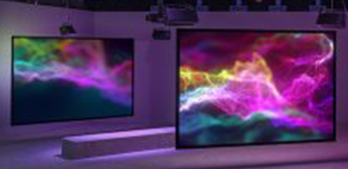
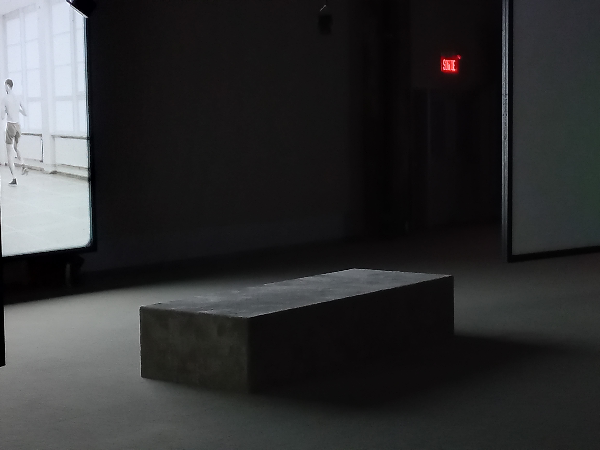
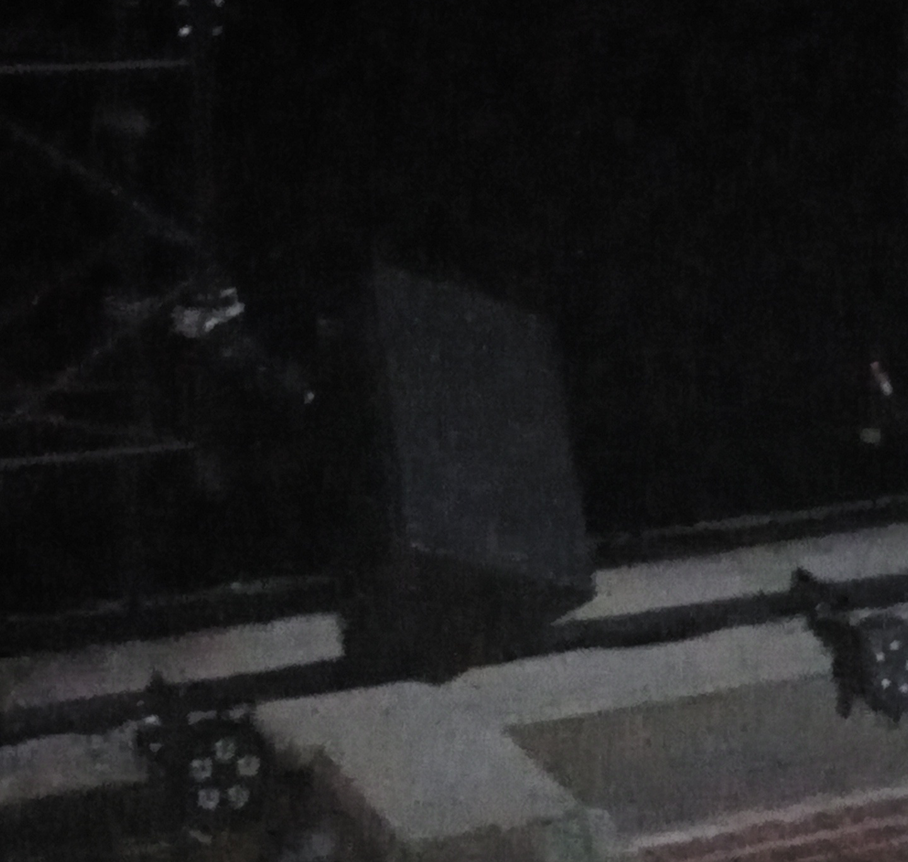

# Phase Shifting Index

Voici moi devant le batiment (troisième personne à partir de la gauche)

## Introduction

L'exposition se trouve à la Fonderie Darling. Nous l'avons visité le 2 février 2024 et c'est une exposition
de type temporaire puisqu'elle était disponible du 12 décembre 2023 jusqu'au 25 février 2024. Elle est immersive puisqu'on
est invités à être plongé dans une expérience. Elle est aussi interieure puisqu'on a besoin de support pour les vidéos.  
 

## **Description de l'oeuvre**

Jeremy Shaw, étant l'artiste derrière l'oeuvre, a voulu explorer et faire ressentir l'effet psychydélique et euphorique de 
drogues dans cette expérience. Il a figuré des personnes de son entourage qui étaient autrefois ses clients qui consommaient 
de la drogue hallucinogène. Son oeuvre a été exposée pour la première fois en 2020. 
Dans l'installation, il y a 7 écrans présents avec les 8 personnes figurantes. Il a varié les espaces temps dans chacune d'elles dans 
un objectif de nous mélanger et ne pas nous faire voir le temps passé. Dans cette phase, on est plongé dans le noir. À un certain
moment et lentement, toutes les danses se sychronisent, les écrans clignotent et au bout d'un moment, tout semble s'arrêter et se 
déformer à travers toutes les vidéos. Ensuite, il y a une dernière phase qui est coloré et ressemble à l'univers (voir image en haut 
de la description). Il y a des lumières violettes qui s'allument et l'atmosphère change complètement. Je la décrirais comme libératrice 
et calme. 
 
Dans les vidéos, il y a plusieurs types de danses comme de la danse robotique. Il y a aussi des vidéos en noir et blanc dont une qui 
montrait se que je pense être une sorte de méditation en groupe. Il y avait aussi une autre vidéo avec seulement 2 personnes qui 
dansaient. Voici certaines photos des vidéos qui étaient projetés ci-dessous. 

                               
  
                          

## Mise en espace
 

 
Comme on peut le voir dans le plan, il y a les 7 projecteurs qui projettent les vidéos. Elles sont disposées de façon que la
personne peut facilement détourner le regard et changer d'atmosphère en fonction de la vidéo. Elles sont suspendues avec des fils
ou sur les murs. La pièce est assez expositionelle puiqu'il n'a pas beaucoup d'éléments, comme dans un musée.  Elle ne prends pas
beaucoup d'espace puisqu'on a seulement besoin de supports et de bancs. 
 

## Composantes et Techniques
Les composantes sont des fils qui supporte les toiles où les vidéos sont projetées. Dans l'image ci-dessous, on peut
voir les fils et juste à droite, les lumières lors de la phase univers.
 
 
   

Elles sont aussi les projecteurs qui permet l'affichage des vidéos.
 
 

### Techniques
Les techniques utilisées pour déplacer l'oeuvre sont une clé USB pour transporter les vidéos et un camions pour les bancs s'ils 
venaient avec.
### Éléments nécessaires pour la mise en exposition 

 
Un projecteur, comme mentionné plus haut. 
 
Les toiles pour amorcer l'affichage.  

Les bancs.  

 
Les haut-parleurs. 
 
Les lumières, comme en haut. 
 
 
 ## Experience vécue
 Mon experience était mitigée. Au début, il ne se passait pas grand chose et je ne comprenais pas le lien entre toutes les vidéos. On
 aurait dit des experiences de personnes différentes dans différentes époques. J'ai mis un peu de temps à réaliser que les danses se 
synchronisaient. J'ai aimé l'expérience sonore lorsque les écrans clignotaient, j'avais l'impression que le temps s'arrêtait et que
je me noyais. Par contre, lorsque les vidéos se déformaient, je me sentais confuse et je ne savais pas quoi comprendre de cette partie.
La phase univers était assez agréable et calme puisqu'il n'avait aucun bruit et les lumières faisaient en sorte que c'était comfortable.
## Ce que j'ai aimé
Après reflexion, l'expérience faisait plus de sens et était réussie. Le but, qui était de nous faire ressentir les effets de la drogue,
peut nous faire passer par multiples émotions comme des émotions refoulées (par exemple: la colère), de l'euphorie, de la confusion et 
du calme total. Si on adopte cette série à l'expérience, la phase des vidéos individuelles serait avant qu'on prend la drogue. Ensuite,
après l'avoir pris (qui représente la synchronisation lente et douce), on pourrait ressentir de la confusion mélangée avec des hallucinations
et des émotions refoulées. Puis, on passerait dans une phase calme et paisible. J'ai aimé l'expérience parce que c'était bien pensé et
on a réussit à ressentir et comprendre quelque chose alors que les vidéos n'avaient pas de lien au début.
## Aspect à améliorer
Se que je ferais differemment, c'est de moins repétés les vidéos au début puisque ce n'est pas tout le monde qui a la patience d'essayer
de comprendre toutes les vidéos. Ces personnes ont un temps d'attention assez court donc peut être moins repéter les vidéos puisque même
moi je pensais que c'était comme ça tout le long à un moment. 
### Réfèrences 
Pour la photo des toiles : https://flash---art.com/article/jeremy-shaw-phase-shifting-index-centre-pompidou-paris/  
