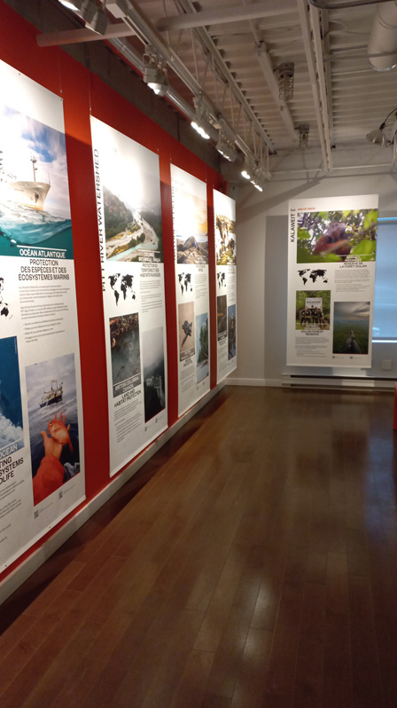
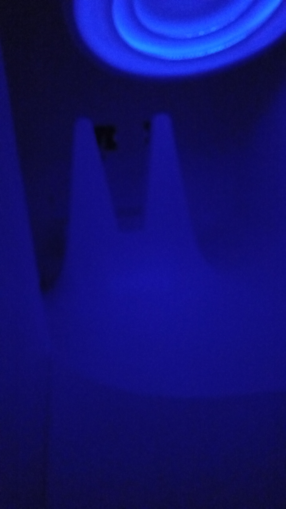

# Sun Room - Age of Union center (2024)
  
Photo venant de moi.
## Description 
La sun room est concue pour se recharger, car le manque de lumière a tendance à nous rendre
de mauvaise humeur plus rapidement et frequemment. C'est un petit espace où on peut se reposer 
et s'apaiser l'esprit. Il y a des murs blancs pour nous faire oublier le temps qui passe et
minimiser les distractions. Au plafond, il y a une lumière led qui représente le soleil et
change de couleur et clignote lentement. Au fond, il y a des lampes à luminotherapie pour que
les gens vivent l'expérience de ce genre de thérapie.  
**Type d'installation : contemplative**  
**Date de visite : 9 mars 2024**  

