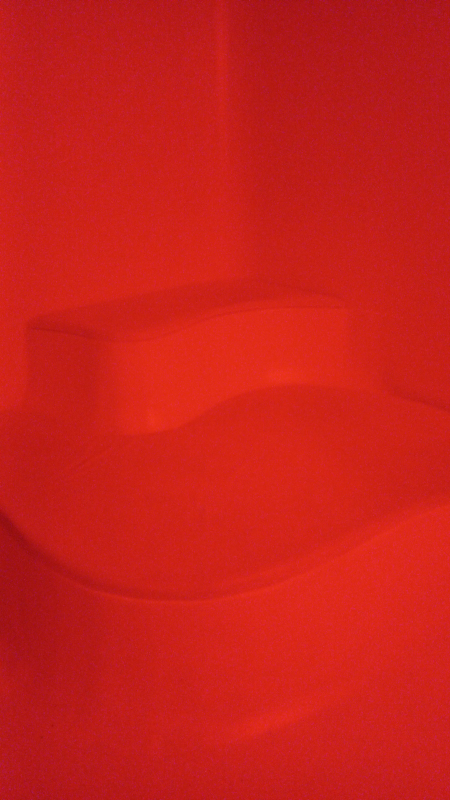

# Sun Room - Age of Union center (2024)
  
Photo venant de moi.
## Description 
La sun room est concue pour se recharger, car le manque de lumière a tendance à nous rendre
de mauvaise humeur plus rapidement et frequemment. C'est un petit espace où on peut se reposer 
et s'apaiser l'esprit. Il y a des murs blancs pour nous faire oublier le temps qui passe et
minimiser les distractions.  
 
**Type d'installation : contemplative**  
**Date de visite : 9 mars 2024**  
  
Photo venant de moi.
### Fonction
  
Photo venant de moi.  
Ici, on nous met dans le contexte avec une citation qui nous dit de faire face à la lumière
et nos problèmes vont se dissiper derrière nous.
## Mise en espace

Au plafond, il y a une lumière led qui représente le soleil qui change de couleur et clignote 
lentement. Au fond, il y a des lampes à luminotherapie pour que les gens vivent l'expérience de 
ce genre de thérapie. Il y a aussi des bancs devant la lumière LED pour se reposer et observer.

## Composantes 
<li> La lumière LED qui change de couleur</li>  
      
<li>Les hauts parleurs </li>  
 
<li>Les lampes lumino-thérapie</li> 
  
<li> Les câbles </li>  
 
<li>Les bancs </li>  

<li>Les murs blanc (présents dans les autres images) </li>

## Expérience vécue
Mon expérience vécue est un peu inattendue comparé à ce que j'attendais, je pensais que se serais 
un peu plus intéressant à regarder mais la salle avait l'air banale. Au final, ça m'a beaucoup 
apaisé et j'ai remarqué que je ne pensais à rien pendant que j'observais. Le temps passait beaucoup
plus lentement. Je pensais passer 15 min mais on dirait qu'il s'était passé 30 minutes après à peu 
près dix minutes. 
## Ce que j'ai aimé
J'ai bien aimé la lumière, car je trouve que visuellement, c'était beau à voir et comment les couleurs 
changaient tranquillement était prévisible et apaisant. Elle clignotait d'une façon lente et je trouve 
que c'est comme ça que le tout semblait très lent. J'ai aussi aimé comment le tout était bien pensé car 
la lumière LED était la seule distraction et les murs blancs est intelligent pour faire ressentir de la 
relaxation dans l'expérience. 
## Ce que je ferais autrement
Il n'y a pas grand chose que je ferais autrement à part le fait d'ajouter plus de texte au lieu d'une 
citation abstraite parce que je voyais des gens passer seulement quelques minutes dans la salle car il 
n'y avait pas grand chose à faire. S'il y aurait plus d'information sur l'intention, je crois que les 
gens essayeront au moins de voir si l'effet est présent et vont plus avoir un avis sur l'expérience.
#### Références
Site web d'Age of Union Center :
https://ageofunion.com/
