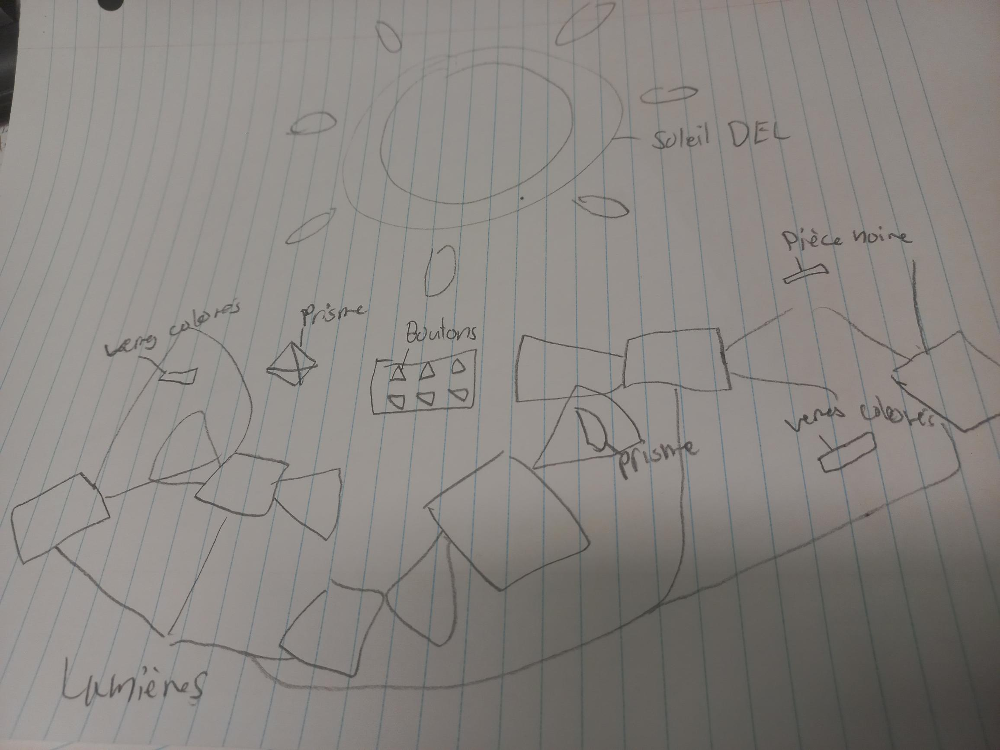

# Lumière : Centre des sciences (2017)
  
Photo prise par moi.   
*Réalisé par Louis Brun, Gabriel Dupras, François Roy-moisan et l'équipe de Sollum Technologies*
## Description
L'exposition est basée sur les 4 éléments de la nature (eau, air, terre, etc). Celle que j'ai
choisie est basée sur la lumière. C'est un mur composé de lumières, de verres colorés, des
formes 3d(prisme, demi-lune) et un objet qui divise la lumière. La personne qui interagit
peut créer des jeux de lumière avec des possibilités illimitées.  
 
**Type d'installation: interactive** 
*Date de visite : 5 avril 2024*
 
   
Photos prise par moi.
## Fonction 

Photo prise par moi.

## Mise en espace

Il y a des lumières en biais pour le côté esthétique et maximiser les possibilités. Les 
éléments interactifs sont les verres colorés, les prismes, des miroirs et les éléments 
qui bloquent la lumière pour un maximum d'expérimentation pour la personne. Ensuite, il 
y a un soleil avec des lumières DEL et une boîte avec des boutons RGB(red green blue) 
pour changer la couleur du soleil. 

## Composantes 
<li>Les lumières</li>
 
 
Photo prise par moi.
 
<li>Le soleil</li>
 
 
Photo prise par moi.
 
<li>Vitre colorée</li>
 
 
Photo prise par moi.
 
<li>Prisme</li>
 
 
Photo prise par moi.
 
<li>Pièce bloquant la lumière</li>
 
 
Photo prise par moi.
 
<li>Les boutons</li>
 
 
Photo prise par moi.

## Elements nécessaires pour la mise en exposition
<li>Un mur</li>

## Expérience vécue 
L'interacteur est censé expérimenter avec les différents éléments. Les éléments vont
élargir ou rétrécir la lumière, la réfléchir ou modifier sa couleur.  
Lorsque je l'ai vu, ça m'as instinctivement interpellé, car c'est un peu en lien avec un
projet personnel que j'ai mais avec des miroirs. Je me suis dit que ça pourrait me donner
des idées si jamais je voudrai le rendre interactif. Au final, j'ai pris plaisir à essayer
plusieurs possibilités et je me sentais comme une enfant. Le résultat me rendait satisfaite
à chaque fois. 

## Ce qui m'a plu et donné des idées 
Ce que j'ai aimé, c'est comment le tout était intéressant et amusant à essayer parce que 
le résultat de différents éléments ensemble m'intriguait. J'ai adoré réfléchir sur quel 
effet donnerait un certain prisme ou même plusieurs prismes. Ce qui m'a donné des idées 
est de changer la lumière de couleur ou faire diffuser la lumière dans de la vitre 
colorée.  

## Ce que je ferais différemment 
Ce que je ferais de différent, c'est d'ajouter une fonction pour modifier l'intensité de la 
lumière ou la trajectoire pour qu'elle aille plus loin ou être plus précise juste parce que
la lumière a tendance à diminuer lorsqu'elle est réfléchie sur un miroir. 

### Références
Site internet du centre des sciences :
https://www.centredessciencesdemontreal.com/
