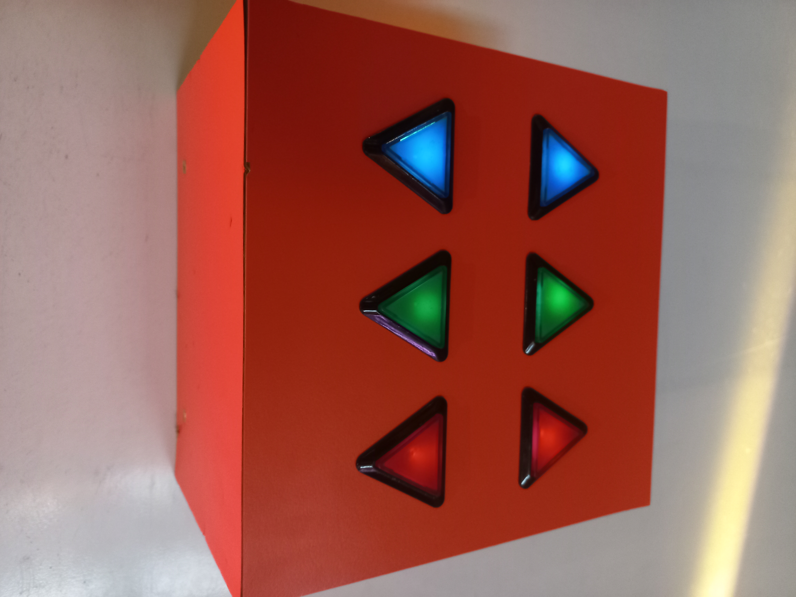

# Lumière : Centre des sciences (2017)
  
Photo prise par moi.   
*Réalisé par Louis Brun, Gabriel Dupras, François Roy-moisan et l'équipe de Sollum Technologies*
## Description
L'exposition est basé sur les 4 éléments de la nature (eau, air, terre, etc). Celle que j'ai
choisie est basé sur la lumière. C'est un mur composé de lumières, de verres colorés, des
formes 3d(prisme, demi-lune) et un objet qui divise la lumière. La personne qui interagit
peut créer des jeux de lumière avec des possibilitées illimitées.  
 
**Type d'installation: interactive** 
 
  
## Fonction 

## Mise en espace
Il y a des lumière en biais pour le côté esthétique et maximiser les possibilitées. Les 
éléments interactifs sont les verres colorés, les prismes, des mirroirs et les éléments 
qui bloquent la lumière pour un maximum d'expérimentation pour la personne. Ensuite, il 
y a un soleil avec des lumières LED et une boîte avec des boutons RGB(red green blue) 
pour changer la couleur du soleil. 

## Composantes 
<li>Les lumières</li>

<li>Le soleil</li>

<li>Verres colorés</li>

<li>Prisme</li>

<li>Pièce bloquant la lumière</li>

<li>Les boutons</li>

## Elements nécessaires pour la mise en exposition
<li>Un mur</li>

## Exprience vécue 
L'interacteur est supposé expérimenter avec les différents éléments. Les élément vont
élargir ou rétrécir la lumière, la réfléchir ou modifier sa couleur.  
Lorsque je l'ai vu, ça m'as instinctivement interpellé, car c'est un peu en lien avec un
projet personnel que j'ai mais avec des mirroirs. Je me suis dit que ça pourrais me donner
des idées si jamais je voudrais le rendre intéractif. Au final, j'ai pris plaisir à essayer
plusieurs possibilitées et je me sentais comme une enfant. 

## Ce qui m'a plu et donné des idées 
Ce que j'ai aimé, c'est comment le tout était intéressant et amusant à essayer. j'ai adoré
réfléchir sur quel effet donnerait un certain prisme ou même plusieurs prismes. Ce qui m'a
donné des idées sont de changer la lumière de couleur ou faire diffusé la lumière dans de
la vitre colorée.

## Ce que je ferais différemment 
Ce que je ferais de différent, c'est d'ajouter une fonction pour modifier l'intensité de la 
lumière ou la trajectoire pour qu'elle aille plus loin ou être plus précise.

### Références
Site internet du centre des sciences :
https://www.centredessciencesdemontreal.com/
